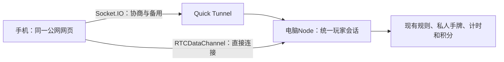

# 单一公网入口与RTC直连实现

更新日期：2026-10-05。版本0.6.0：用户明确授权的方案已接入并通过自动化验证；桌面与微信真机结果分别记录，不将桌面测试当作微信验收。

所有玩家扫描同一个Quick Tunnel入口，在同一HTTPS站点保存身份。先通过现有Socket.IO入座并立即开始游戏，后台协商手机至电脑的RTCDataChannel。验证直连可用后，实时命令和私人状态优先经RTC；公网连接持续保留，用于信令、回执重试及备用。页面、音频和首次入座仍需要公网入口可达。

这一方案不依赖固定域名或家中DNS分流，也不将HTTP私网请求作为加速探测手段。RTC使用自己的连接建立与DTLS加密；Quick Tunnel承载网页与信令，不承担RTC直连数据的UDP转发。只建立数据通道，不调用摄像头或麦克风API。浏览器的本地网络权限、微信实现和系统策略仍可能影响连接，不能保证每部手机都静默直连；受限时保留可用的公网游戏路径。

## 由0.5.0升级

0.5.0的`Session`包含房间、玩家与令牌，已有重连、换桌入座回执缓存和`revision`校验，但身份绑定、在线状态和广播都绑定Socket.IO连接；普通出牌没有可跨通道复用的命令回执。`revision`可以拒绝过期动作，却不能回答“上一条动作已经执行，只有回执丢了”这一问题。当时客户端也根据Socket.IO连接状态禁止操作；0.6.0已改为逻辑会话的可用状态。

0.6.0使用锁定版本werift 0.24.4（MIT），电脑Node直接作为RTC对端。每位玩家一个数据连接，运行在同一游戏进程，没有浏览器转发页、原生编译步骤或额外玩家进程。当前直连只收集IPv4主机候选，浏览器可提交mDNS候选，库提供mDNS解析；IPv6加速尚未启用，受限环境继续走公网。库来源：[官方源码](https://github.com/shinyoshiaki/werift-webrtc)。

## 已实现的协议

1. 房间、玩家、令牌与消息序号属于逻辑会话；Socket.IO和RTC只承载同一套命令。已认证的公网连接交换RTC信令，并用短期连接凭据绑定同一个座位。换通道不再次加入房间，旧桌／旧连接的RTC凭据失效。候选地址仅交换给对应的已授权玩家，公开配置继续不列内网地址。
2. 命令带稳定的`commandId`、玩家命令序号及预期牌局版本，两条链路重发相同信封。服务端先查已执行回执，再做版本校验和规则判定；相同ID、不同载荷应拒绝。命令在同一房间串行处理，回执缓存覆盖重试窗口，重复到达只返回第一次结果。
3. 状态另带单调版本，客户端忽略迟到的旧快照。命令回执按`commandId`匹配，不能因为后收到较新的状态就丢弃旧命令回执。切换时恢复当前私人快照与待确认命令，不回滚手牌或重复播报。序号以当前服务实例和逻辑会话为范围；服务重启、房间销毁仍沿用当前不恢复内存牌局的边界。
4. DataChannel使用可靠、有序模式；其可靠性只作用于该连接，不代替跨Socket.IO／RTC的去重与重试。`open`后还要完成身份验证和应用层往返确认，才提升为优先链路。
5. 不等待RTC连接成功才让玩家入座或操作。RTC消息缺回执、通道错误或健康检测失败后，通过已有公网链路重发同一命令；恢复直连后再验证，避免来回频繁切换。“无感”指不换桌、不要求玩家操作、不重复执行，可有短时等待，不能保证零延迟。
6. 在线状态合并两条链路：公网断但RTC可用，或RTC断但公网可用，都不将玩家判为离线、不暂停30秒回合；两条链路均不可用才进入既有离线暂停和恢复流程。30秒期限继续由游戏服务统一持有，迟到命令仍按规则拒绝。
7. 两条链路共用身份、限额、消息大小限制和规则校验，私人手牌仍只发送给所属玩家。退出、换桌、实例关闭时清理RTC连接、UDP资源、心跳、待确认队列与回执，不能通过切换链路绕过限制。

首轮以本地直连加速为目标，不额外建立TURN服务：直连失败就使用已经存在的公网通道，不增加第二套公网中继。无需先准确判断是否同一Wi-Fi，ICE尝试连接，最终以已选候选对、实际往返和可用性确认直连，不能根据IP相同或DataChannel打开就宣称已验证局域网性能。

## 必须验证

- Windows电脑与浏览器数据通道互通；IPv4／IPv6、mDNS候选处理、系统防火墙和Wi-Fi隔离下的失败路径。记录所选ICE候选对及往返，证明数据确实走直接路径。
- Android微信和iPhone微信实机：同Wi-Fi、移动流量、异地Wi-Fi、后台返回、切网；不能用桌面Chrome证明微信可静默直连或无需权限操作。
- 在出牌已执行而回执丢失时切回公网：同一命令得到原回执，手牌只减少一次，声音只播一次；两路同时到达、乱序、旧连接迟到同样覆盖。
- RTC断、公网断、两路都断及恢复；身份和座位不变，状态不回滚，30秒时钟不被链路切换重置。
- 连续入座、换桌、退出和关闭启动器后资源回收；每次连接不会残留额外进程、UDP端口或计时器。

实现对应：`apps/server/src/direct-peer.ts`、`command-ledger.ts`、`server.ts`及`apps/web/src/player-connection.ts`。浏览器使用128位随机命令ID和256位随机连接凭据；Socket重连沿用连接凭据，刷新页面以原座位令牌建立新逻辑连接并撤销旧页。RTC答复携带短期一次连接凭据，15秒内须完成数据通道认证；协商只允许当前有效座位，每逻辑连接至少间隔10秒。

命令最大16KiB，SDP最大12KiB／32候选，禁止媒体轨道；两路共享原访问者600次／分钟限额。回执按120秒期限定期清理、最多256条，同时保存最高序号；清理或淘汰的旧序号只能拒绝，不能重新执行。RTC命令350毫秒无回执后发送同一信封到公网；普通公网每1200毫秒重试，总时间仍为现有6秒操作预算。连接可用时允许Socket.IO排队，单次回执等待使用剩余操作预算，避免长轮询繁忙时丢弃命令或慢网过早超时。12秒未建成直连即放弃本次尝试，20秒后台重试，玩家不等待协商。

状态在两路镜像传输，用相同实例ID和单调版本过滤迟到／重复快照。少量公网备份状态流量仍存在；正常直连下操作与首次收到的状态可走局域网，且不会把可靠性依赖于关闭公网连接。回执不受快照版本过滤，避免已执行的出牌被误报失败。

目前9项新增RTC／协议检查及75项原验证全部通过；包含五种玩法整局和新实例替换旧直连。正式公网浏览器已建立UDP主机候选直连，真实隧道整局与启动器清理也已完成。真实微信、不同物理设备与受限网络仍是待验项，测试详情见[验证记录](testing.md)。

## 一手资料

- [WebRTC官方数据通道说明](https://webrtc.org/getting-started/data-channels)。
- [MDN：WebRTC数据通道及DTLS加密](https://developer.mozilla.org/en-US/docs/Web/API/WebRTC_API/Using_data_channels)。
- [Socket.IO：顺序、默认投递及应用层保证](https://socket.io/docs/v4/delivery-guarantees/)。
- [MDN：本地网络访问限制](https://developer.mozilla.org/en-US/docs/Web/Security/Defenses/Local_network_access)。
- [werift官方仓库](https://github.com/shinyoshiaki/werift-webrtc)、[node-datachannel官方仓库](https://github.com/murat-dogan/node-datachannel)。
